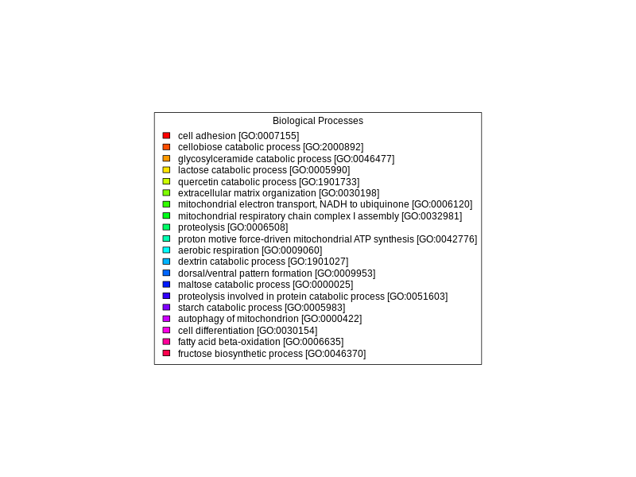

```{r time, eval=TRUE, echo=FALSE}
current_time <- format(Sys.time(), "%B %d, %Y %H:%M:%S")
cat("current date and time is ", current_time)
```

```{r setup, include=FALSE}
library(knitr)
library(tidyverse)
#library(kableExtra)
library(DT)
library(Biostrings)
library(tm)
library(reshape2)
knitr::opts_chunk$set(
  echo = TRUE,         # Display code chunks
  eval = FALSE,         # Evaluate code chunks
  warning = FALSE,     # Hide warnings
  message = FALSE,     # Hide messages
  fig.width = 6,       # Set plot width in inches
  fig.height = 4,      # Set plot height in inches
  fig.align = "center" # Align plots to the center
)
```

## Introduction

I will be re-creating **01-blast.Rmd** to explore some of the functionality in markdown. In this document, I will be taking an unknown multi-fasta file and annotating it using NCBI Blast software. 

**1. What is a multi-fasta file? Glad you asked!**

- a plain text file used in bioinformatics to store multiple (thousands) of biological sequences in a single place.

- later, we will explore what these fasta files contain.

# Database creation

## Download blast software

I am going download the blast software, which I will be using to compare our unknown sequences to known sequences.

```{bash}
cd /home/jovyan/applications
curl -O https://ftp.ncbi.nlm.nih.gov/blast/executables/blast+/LATEST/ncbi-blast-2.16.0+-x64-linux.tar.gz
tar -xf ncbi-blast-2.16.0+-x64-linux.tar.gz
```

Let's check what we've just downloaded...

```{bash}
pwd
ncbi-blast-2.16.0+/bin/blastx -h
```

-h displays the help message associated with the blastx document. This help message provides a list of available command-line options, their descriptions, and instructions for using blastx.

## Obtain the fasta file (UniProt/Swiss-Prot)

```{bash}
cd data/blast_data
curl -O https://ftp.uniprot.org/pub/databases/uniprot/current_release/knowledgebase/complete/uniprot_sprot.fasta.gz
mv uniprot_sprot.fasta.gz uniprot_sprot_r2025_04_03.fasta.gz
gunzip -k uniprot_sprot_r2025_04_03.fasta.gz
```
What files did we just download?

```{bash}
ls data/blast_data
```

```{bash}
./ncbi-blast-2.16.0+/bin/makeblastdb \
-in data/blast_data/uniprot_sprot_r2025_04_03.fasta \
-dbtype prot \
-out data/blast_data/uniprot_sprot_r2025_04_03
```

## Getting the query fasta file

```{bash}
curl https://eagle.fish.washington.edu/cnidarian/Ab_4denovo_CLC6_a.fa \
-k \
> ./data/blast_data/Ab_4denovo_CLC6_a.fa
```

## Exploring the fasta file 

```{bash}
head ./data/blast_data/Ab_4denovo_CLC6_a.fa
```
Okay, we are finally looking at our sequence reads! 

A fasta file can be recognized by a couple key characteristics:

- A header line that starts with a ">" character, followed by a sequence identifier and, likely, an optional description.

- Lines that contain the sequence (or sequences), represented by the nucleotide letters we are all familiar with (A, G, C, and T). 

**How many sequences are there?**

```{bash}
#echo "How many sequences are there?"
grep -c ">" ./data/blast_data/Ab_4denovo_CLC6_a.fa
```
**What is the frequency distribution of our sequence lengths?**

```{r histogram, eval=TRUE}
# Read FASTA file
fasta_file <- "./data/blast_data/Ab_4denovo_CLC6_a.fa"  # Replace with the name of your FASTA file
sequences <- readDNAStringSet(fasta_file)

# Calculate sequence lengths
sequence_lengths <- width(sequences)

# Create a data frame
sequence_lengths_df <- data.frame(Length = sequence_lengths)

# Plot histogram using ggplot2
ggplot(sequence_lengths_df, aes(x = Length)) +
  geom_histogram(binwidth = 1, color = "#57b0df", alpha = 0.75) +
  labs(title = "Histogram of Sequence Lengths",
       x = "Sequence Length",
       y = "Frequency") +
  theme_minimal()
```

Pretty! Our frequency distributions look like a tsunami wave...lots of sequences around 100 or so base pairs in length, and skewed right.

**What is the base composition of our sequences?**


```{r ACGT, eval=TRUE}
# Read FASTA file
fasta_file <- "./data/blast_data/Ab_4denovo_CLC6_a.fa"
sequences <- readDNAStringSet(fasta_file)

# Calculate base composition
base_composition <- alphabetFrequency(sequences, baseOnly = TRUE)

# Convert to data frame and reshape for ggplot2
base_composition_df <- as.data.frame(base_composition)
base_composition_df$ID <- rownames(base_composition_df)
base_composition_melted <- reshape2::melt(base_composition_df, id.vars = "ID", variable.name = "Base", value.name = "Count")

# Plot base composition bar chart using ggplot2
ggplot(base_composition_melted, aes(x = Base, y = Count, fill = Base)) +
  geom_bar(stat = "identity", position = "dodge", color = "black") +
  labs(title = "Base Composition",
       x = "Base",
       y = "Count") +
  theme_minimal() +
  scale_fill_manual(values = c("A" = "#DAF7A6", "C" = "#FFC300", "G" = "#FF5733", "T" = "#C70039"))
```

All bases lie between 300 and about 475 in count. We have a few bases categorized as *other*. Let's take a closer look...


# Run blast

```{bash, eval=FALSE}
/home/shared/ncbi-blast-2.15.0+/bin/blastx \
-query ../data/Ab_4denovo_CLC6_a.fa \
-db ../output/01-blast/blastdb/uniprot_sprot_r2025_04_03 \
-out ../output/01-blast/Ab_4-uniprot_blastx.tab \
-evalue 1E-20 \
-num_threads 20 \
-max_target_seqs 1 \
-outfmt 6
```

```{r blast-look, engine='bash', eval=TRUE}
head -2 output/Ab_4-uniprot_blastx.tab
```

```{r blast-look2, engine='bash', eval=TRUE}
echo "Number of lines in output"
wc -l output/Ab_4-uniprot_blastx.tab
```
# Joining Blast table with annoations.

## Prepping Blast table for easy join

```{r separate, engine='bash', eval=TRUE}
tr '|' '\t' < output/Ab_4-uniprot_blastx.tab \
> output/Ab_4-uniprot_blastx_sep.tab

head -1 output/Ab_4-uniprot_blastx_sep.tab

```
## Could do some cool stuff in R here reading in table

```{r read-data, eval=TRUE, cache=TRUE}
bltabl <- read.csv("output/Ab_4-uniprot_blastx_sep.tab", sep = '\t', header = FALSE)

spgo <- read.csv("https://gannet.fish.washington.edu/seashell/snaps/uniprot_table_r2023_01.tab", sep = '\t', header = TRUE)
```

```{r, eval=TRUE}
datatable(head(bltabl), options = list(scrollX = TRUE, scrollY = "400px", scrollCollapse = TRUE, paging = FALSE))
```

```{r spgo-table, eval=TRUE}
datatable(head(spgo), options = list(scrollX = TRUE, scrollY = "400px", scrollCollapse = TRUE, paging = FALSE))
```

```{r see, eval=TRUE}
datatable(
  left_join(bltabl, spgo,  by = c("V3" = "Entry")) %>%
  select(V1, V3, V13, Protein.names, Organism, Gene.Ontology..biological.process., Gene.Ontology.IDs) %>% mutate(V1 = str_replace_all(V1, 
            pattern = "solid0078_20110412_FRAG_BC_WHITE_WHITE_F3_QV_SE_trimmed", replacement = "Ab"))
)
```

```{r join}
annot_tab <-
  left_join(bltabl, spgo,  by = c("V3" = "Entry")) %>%
  select(V1, V3, V13, Protein.names, Organism, Gene.Ontology..biological.process., Gene.Ontology.IDs) %>% mutate(V1 = str_replace_all(V1, 
            pattern = "solid0078_20110412_FRAG_BC_WHITE_WHITE_F3_QV_SE_trimmed", replacement = "Ab"))
```


```{r, eval=TRUE}
# Read dataset
dataset <- read.csv("blast_annot_go.tab", sep = '\t')  # Replace with the path to your dataset

# Select the column of interest
column_name <- "Organism"  # Replace with the name of the column of interest
column_data <- dataset[[column_name]]

# Count the occurrences of the strings in the column
string_counts <- table(column_data)

# Convert to a data frame, sort by count, and select the top 10
string_counts_df <- as.data.frame(string_counts)
colnames(string_counts_df) <- c("String", "Count")
string_counts_df <- string_counts_df[order(string_counts_df$Count, decreasing = TRUE), ]
top_10_strings <- head(string_counts_df, n = 10)

# Plot the top 10 most common strings using ggplot2
ggplot(top_10_strings, aes(x = reorder(String, -Count), y = Count, fill = String)) +
  geom_bar(stat = "identity", position = "dodge", color = "black") +
  labs(title = "Top 10 Species hits",
       x = column_name,
       y = "Count") +
  theme_minimal() +
  theme(legend.position = "none") +
  coord_flip()


```

```{r go, eval=TRUE}


data <- read.csv("blast_annot_go.tab", sep = '\t')

# Rename the `Gene.Ontology..biological.process.` column to `Biological_Process`
colnames(data)[colnames(data) == "Gene.Ontology..biological.process."] <- "Biological_Process"

# Separate the `Biological_Process` column into individual biological processes
data_separated <- unlist(strsplit(data$Biological_Process, split = ";"))

# Trim whitespace from the biological processes
data_separated <- gsub("^\\s+|\\s+$", "", data_separated)

# Count the occurrences of each biological process
process_counts <- table(data_separated)
process_counts <- data.frame(Biological_Process = names(process_counts), Count = as.integer(process_counts))
process_counts <- process_counts[order(-process_counts$Count), ]

# Select the 20 most predominant biological processes
top_20_processes <- process_counts[1:20, ]

# Create a color palette for the bars
bar_colors <- rainbow(nrow(top_20_processes))

# Create a staggered vertical bar plot with different colors for each bar
barplot(top_20_processes$Count, names.arg = rep("", nrow(top_20_processes)), col = bar_colors,
        ylim = c(0, max(top_20_processes$Count) * 1.25),
        main = "Occurrences of the 20 Most Predominant Biological Processes", xlab = "Biological Process", ylab = "Count")


# Create a separate plot for the legend
png("output/GOlegend.png", width = 800, height = 600)
par(mar = c(0, 0, 0, 0))
plot.new()
legend("center", legend = top_20_processes$Biological_Process, fill = bar_colors, cex = 1, title = "Biological Processes")
dev.off()
```

```{r legend, eval=TRUE, fig.width = 100 ,fig.height = 100}

```
