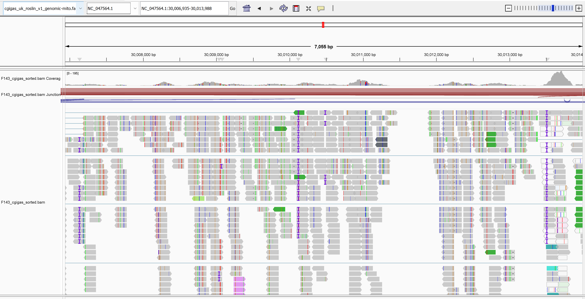
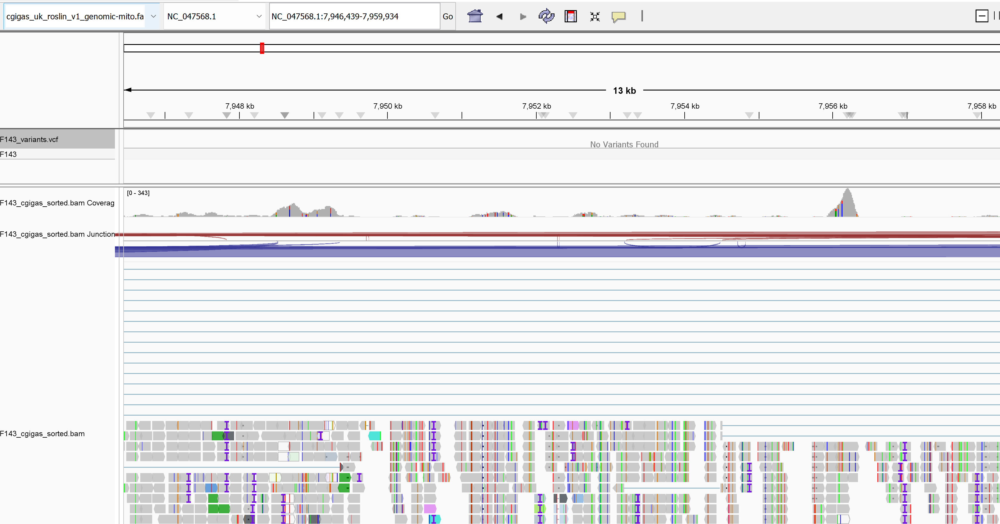
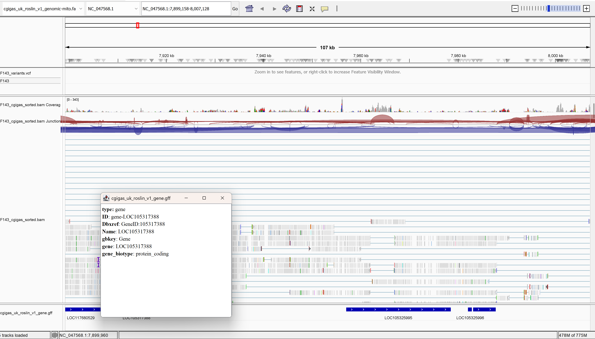

```{r setup, include=FALSE}
knitr::opts_chunk$set(echo = TRUE, eval=FALSE)
```

## Assignment

Create and inspect and alignment files. Including visualizing and capturing "outside" graphics. Publish notebook in rpubs and provide link at top of code.

# Task 1

Looking at Alignment Files

## Download alignment data


```{r, engine='bash'}         
cd ./data
curl -O https://gannet.fish.washington.edu/seashell/bu-mox/scrubbed/120321-cvBS/19F_R1_val_1_bismark_bt2_pe.deduplicated.sorted.bam
curl -O https://gannet.fish.washington.edu/seashell/bu-mox/scrubbed/120321-cvBS/19F_R1_val_1_bismark_bt2_pe.deduplicated.sorted.bam.bai
```

```{r, engine='bash'}         
cd ./data
curl -O https://gannet.fish.washington.edu/seashell/bu-mox/data/Cvirg-genome/GCF_002022765.2_C_virginica-3.0_genomic.fa
curl -O https://gannet.fish.washington.edu/seashell/bu-mox/data/Cvirg-genome/GCF_002022765.2_C_virginica-3.0_genomic.fa.fai
```

## Visualize with tview

```{bash}
/home/shared/samtools-1.12/samtools tview \
data/19F_R1_val_1_bismark_bt2_pe.deduplicated.sorted.bam \
data/GCF_002022765.2_C_virginica-3.0_genomic.fa
```

## Capture Image

screenshot of the `tview` display...


# Task II

Aligning WGS data and visualizing in IGV

```{r, engine='bash'}
cd data
curl -O https://owl.fish.washington.edu/nightingales/C_gigas/F143n08_R2_001.fastq.gz
curl -O https://owl.fish.washington.edu/nightingales/C_gigas/F143n08_R1_001.fastq.gz
```

```{r, engine='bash'}
cd data
curl -O https://gannet.fish.washington.edu/panopea/Cg-roslin/cgigas_uk_roslin_v1_genomic-mito.fa
curl -O https://gannet.fish.washington.edu/panopea/Cg-roslin/cgigas_uk_roslin_v1_genomic-mito.fa.fai
curl -O https://gannet.fish.washington.edu/panopea/Cg-roslin/GCF_902806645.1_cgigas_uk_roslin_v1_genomic-mito.gtf
```

## Alignment

hisat aligns to a single organism's genome

```{r, engine='bash'}
# point to the .fa and make an index for this file
/home/shared/hisat2-2.2.1/hisat2-build \
-f data/cgigas_uk_roslin_v1_genomic-mito.fa \
output/cgigas_uk_roslin_v1_genomic-mito.index
```


```{r, engine='bash'}
# point to the index and use the index to align the .gz files, the output will be a .sam file
/home/shared/hisat2-2.2.1/hisat2 \
-x output/cgigas_uk_roslin_v1_genomic-mito.index \
-p 4 \
-1 data/F143n08_R1_001.fastq.gz \
-2 data/F143n08_R2_001.fastq.gz \
-S output/F143_cgigas.sam
```

Take a look

```{r, engine='bash'}
tail -1 output/F143_cgigas.sam
```

```{r, engine='bash'}
# Convert SAM to BAM, using 4 additional threads
/home/shared/samtools-1.12/samtools view -@ 4 -bS \
output/F143_cgigas.sam > output/F143_cgigas.bam
```

```{r, engine='bash'}
# Sort the BAM file, using 4 additional threads
/home/shared/samtools-1.12/samtools sort -@ 4 \
output/F143_cgigas.bam -o ../output/F143_cgigas_sorted.bam

# Index the sorted BAM file (multi-threading is not applicable to this operation)
/home/shared/samtools-1.12/samtools index \
output/F143_cgigas_sorted.bam
```

## mpileup

```{r, engine='bash'}
/home/shared/bcftools-1.14/bcftools mpileup --threads 4 --no-BAQ \
--fasta-ref ../data/cgigas_uk_roslin_v1_genomic-mito.fa \
output/F143_cgigas_sorted.bam > output/F143_mpileup_output.txt
```

```{r, engine='bash'}
tail output/F143_mpileup_output.txt
```

```{r, engine='bash'}
cat output/F143_mpileup_output.txt \
| /home/shared/bcftools-1.14/bcftools call -mv -Oz \
> output/F143_mpile.vcf.gz
```


```{r, engine='bash'}
zgrep "^##" -v output/F143_mpile.vcf.gz | \
awk 'BEGIN{OFS="\t"} {split($8, a, ";"); print $1,$2,$4,$5,$6,a[1],$9,$10}' | head

```


The code below might not work. That is fine. The VCF in the above chunk can be used for visualization in IGV.

```{r, engine='bash'}
/home/shared/bcftools-1.14/bcftools call \
-v -c output/F143_mpile.vcf.gz \
> output/F143_mpile_calls.vcf
```

## Visualize in IGV!






